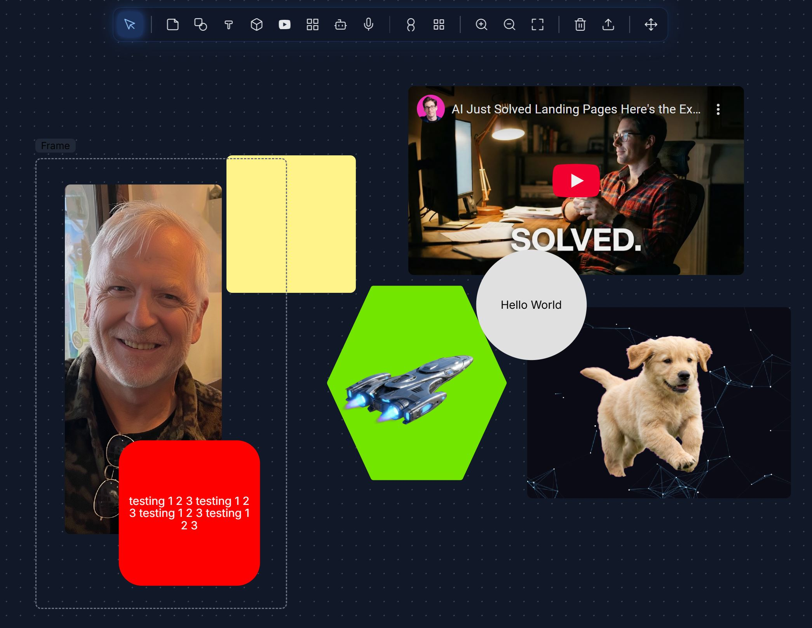

<div align="center">

</div>

# Mero - AI-Powered Infinite Canvas

**Mero** is an advanced infinite canvas application that combines creative workflows with cutting-edge AI capabilities. Create, edit, and collaborate with AI-powered media generation, speech recognition, and intelligent assistance.

🎨 **Infinite Canvas** • 🤖 **AI Integration** • 🎙️ **Speech Recognition** • 📱 **Responsive Design**

## 📊 Current Status

**Last Updated:** December 25, 2025

### ✅ **Completed Features**
- ✅ **NEW:** Interactive animated background with mouse-following glow effect
- ✅ **NEW:** AI background removal with professional chroma key despill algorithm
- ✅ **NEW:** Pen tool markup for AI image editing - draw on images to indicate areas to change
- ✅ **FIXED:** AI image editing now preserves original aspect ratio
- ✅ **FIXED:** PNG/JPEG export now preserves correct image aspect ratios
- ✅ **NEW:** Gemini Nano Banana Pro integration for intelligent image editing
- ✅ **NEW:** Professional compositor export system with 1K/2K/4K resolution options
- ✅ **NEW:** Secure server-side API key storage with AES-256-CBC encryption
- ✅ **NEW:** Glassmorphism UI design for toolbar with Electric Blue theme
- ✅ **NEW:** Animated constellation network background on login screen
- ✅ **NEW:** Multi-item selection and export (Shift+Click for mixed types)
- ✅ **NEW:** Beautiful hover glow effects on toolbar and logout button
- ✅ **FIXED:** Selection no longer changes item z-index/layering
- ✅ **FIXED:** Export hides selection handles for clean output
- ✅ **FIXED:** Select tool properly deselects when other tools chosen
- ✅ Backend API server with Express.js and SQLite database
- ✅ User authentication (register/login with JWT tokens)
- ✅ Server-side board and item persistence
- ✅ Auto-center content below toolbar on board load/switch
- ✅ Remembers last used board on reload
- ✅ Rounded corners on shapes (Triangle, Diamond, Hexagon)
- ✅ Contextual toolbar tooltips appear above (not blocking objects)
- ✅ **FIXED:** Board saving mechanism with race condition protection
- ✅ **FIXED:** Windows start.bat script port detection
- ✅ Infinite canvas with smooth pan/zoom functionality
- ✅ Scroll wheel zoom that works everywhere on canvas
- ✅ Toolbar remains fixed at all zoom levels (no scaling)
- ✅ Middle mouse button panning
- ✅ 🎤 Voice commands to create items at cursor (Ctrl+Alt+V)
- ✅ Enhanced tooltips below toolbar buttons (never block the tool)
- ✅ Multi-board management system with folders
- ✅ IndexedDB integration for local storage (offline mode)
- ✅ Automatic localStorage migration on first launch
- ✅ Fixed item persistence with proper undo/redo initialization
- ✅ Visual mouse-following placement system with pixel-perfect accuracy
- ✅ Multiple item types (sticky notes, shapes, text, images, videos)
- ✅ AI assistant with Gemini integration
- ✅ Speech-to-text recognition in AI chat and voice commands
- ✅ AI image editing with Gemini
- ✅ AI video generation with Veo 2
- ✅ Drag & drop file support
- ✅ Export functionality (PNG, JPG, PDF, CSV)
- ✅ YouTube video embedding
- ✅ Flexible toolbar positioning (top/left/bottom/right)
- ✅ Context menus and keyboard shortcuts
- ✅ Undo/redo functionality
- ✅ Responsive design and dark theme
- ✅ DOM-based coordinate calculation (no transformation bugs)

### 🔧 **Current Development Status**
- **Active Branch:** master
- **Recent Focus:** ✅ **COMPLETED** - Backend API & Authentication
- **Tech Stack:** React 19, TypeScript, Vite, Tailwind CSS, Dexie.js (IndexedDB)
- **Backend:** Express.js, SQLite (better-sqlite3), JWT authentication
- **AI Providers:** Google Gemini (all AI features)
- **Working Features:** Core canvas, AI assistant, voice commands, image editing, multi-board management, user auth
- **Database:** SQLite (server) + IndexedDB (client offline mode)
- **Latest Achievements (Dec 16, 2025 - Evening):** 
  - ✅ **NEW:** Professional compositor with 1K/2K/4K export
  - ✅ **NEW:** Secure API key encryption (AES-256-CBC)
  - ✅ **NEW:** Glassmorphism toolbar with Electric Blue glow
  - ✅ **NEW:** Constellation network animated login
  - ✅ **NEW:** One-click desktop launcher (start.bat with auto-browser)
  - ✅ **FIXED:** Selection doesn't change z-index layering
  - ✅ **FIXED:** Export hides handles, preserves alpha
  - ✅ **FIXED:** Select tool highlight behavior

### 🔍 **Recent Updates (Dec 25, 2025)**

**Session: Interactive Animated Background**
- ✅ **NEW:** Interactive background pattern with mouse-following glow
  - Animated dot/rectangle grid that responds to mouse movement
  - Smooth lerped cursor tracking with configurable delay
  - Color cycling through palette (green, pink, blue, orange, purple, yellow, white)
  - Pulsing/breathing glow radius effect
  - Replaces static CSS dot grid when enabled
  - Uses `dotDensity` setting for grid spacing
  - Fully non-blocking: `pointerEvents: none` - all interactions pass through
  - Toggle via `useInteractiveBackground` prop on Board component

### 🔍 **Previous Updates (Dec 24, 2025)**

**Session: Aspect Ratio Fixes & Background Removal**
- ✅ **Fixed:** AI image editing aspect ratio distortion
  - Gemini sometimes returns images with different aspect ratios
  - Now automatically resizes returned images to match original dimensions
  - Added aspect ratio instructions to Gemini prompts
  - Images no longer appear stretched or squished after AI edits
- ✅ **Fixed:** Export (PNG/JPEG) aspect ratio preservation
  - Export now replicates `object-fit: contain` behavior
  - Images maintain their natural aspect ratio when exported
  - Properly centered within item bounds (no stretching)
- ✅ **NEW:** AI background removal with transparent output
  - Request background removal via AI edit prompts ("remove background", "transparent background")
  - Uses magenta chroma key technique for clean transparency
  - Professional 4-pass despill algorithm eliminates color fringing:
    - Pass 1: Color difference keying for alpha matte generation
    - Pass 2: 3x3 matte erosion for edge refinement
    - Pass 3: Mathematical despill (removes magenta contamination from RGB)
    - Pass 4: Multi-iteration edge color propagation
  - Industry-standard approach similar to Keylight/Primatte compositing tools
- ✅ **NEW:** Loading spinner during AI image edits
  - Visual feedback when AI processing begins
  - Spinner appears immediately, hides on completion or error
- ✅ **FIXED:** Full page export now captures all items
  - Switched to high-quality compositor for all exports (removed html2canvas fallback)
  - Added support for Frames, YouTubeVideos, and ObsidianNotes in export
  - Consistent export quality whether items are selected or not

### 🔍 **Previous Updates (Dec 17, 2025)**

**Session: Pen Tool AI Image Editing**
- ✅ **Implemented:** Pen tool markup system for targeted AI edits
  - Draw red marks directly on images to indicate edit areas
  - Inline prompt appears when markup is detected
  - Composites markup with image before sending to AI
- ✅ **Integrated:** Gemini Nano Banana Pro (gemini-3-pro-image-preview)
  - High-quality image understanding and generation
  - Processes red markup as edit instructions
  - Returns edited image with changes applied to marked areas
- ✅ **Fixed:** Race condition between image update and markup clearing
  - Combined both updates into single state change
  - Prevents stale state overwrites
- ✅ **Fixed:** Red pen marks now auto-clear when edited image returns
  - Canvas cleared via useEffect in DrawingOverlay
  - Clean result without residual markup

### 🔍 **Previous Updates (Dec 16, 2025 - Evening Session)**

**Session: Professional Compositor & UI Polish**
- ✅ **Implemented:** High-quality compositor export system
  - Direct canvas rendering (bypasses html2canvas for images)
  - Resolution selector: 1K (1024px), 2K (2048px), 4K (4096px)
  - Renders shapes directly to canvas via path commands
  - Preserves alpha transparency for PNG exports
  - Proper z-index ordering during compositing
  - Rotation support with mathematical transforms
- ✅ **Implemented:** Secure API key storage
  - Server-side encryption with AES-256-CBC
  - Random IV for each encryption
  - API endpoints: POST/GET/DELETE `/auth/api-key`
  - Database migration for existing users
  - Falls back to env variable if no stored key
- ✅ **Implemented:** Glassmorphism UI design
  - Electric Blue themed toolbar with backdrop blur
  - Subtle blue glow on hover (22px + 45px spread)
  - Tool buttons glow when active or hovered
  - Dropdown menus match glassmorphism theme
  - Beautiful logout button with username display
- ✅ **Implemented:** Constellation network login background
  - 80 animated floating particles
  - Dynamic connection lines between nearby particles
  - Smooth canvas animation with requestAnimationFrame
- ✅ **Fixed:** Multi-selection improvements
  - Selection no longer boosts z-index by 1000
  - Items stay at their visual layer when selected
  - Shift+Click works for mixed item types (shapes + images)
- ✅ **Fixed:** Export quality improvements
  - Selection handles hidden during capture
  - Selection restored after export completes
  - Uniform scale factor prevents aspect ratio distortion
- ✅ **Fixed:** Toolbar select tool behavior
  - Arrow/select button only highlights when no tool active
  - Properly deselects when other tools are chosen
- ✅ **Improved:** Desktop launcher (start.bat)
  - One-click launch from desktop shortcut
  - Progress indicators [1/5] through [5/5]
  - Auto-installs dependencies on first run
  - Automatic browser launch after servers ready
  - Self-closing launcher window

### 🔍 **Previous Updates (Dec 16, 2025 - Morning Session)**

**Session: Backend API & Authentication**
- ✅ **Implemented:** Full backend API server
  - Express.js server with RESTful API endpoints
  - SQLite database using better-sqlite3
  - JWT-based authentication (register/login)
  - Board and canvas item CRUD operations
  - Image upload support with multer
- ✅ **Fixed:** Board saving race conditions
  - Added `hasLoadedFromServerRef` to prevent premature syncs
  - Protected against empty item arrays wiping data
  - Proper state initialization before sync
- ✅ **Fixed:** Windows start.bat script
  - Corrected port detection using temp files
  - Fixed batch variable expansion issues
- ✅ **Improved:** Board loading UX
  - Content auto-centers below toolbar on load
  - Last used board remembered via localStorage
  - Horizontal center + top padding positioning
- ✅ **Improved:** Shape aesthetics
  - Added rounded corners to Triangle, Diamond, Hexagon
  - Softer, more modern appearance using strokeLinejoin
- ✅ **Improved:** Contextual toolbar tooltips
  - Now appear above buttons instead of below
  - No longer block view of selected objects

### 🔍 **Previous Updates (Nov 14, 2025)**

**Session: Voice Commands & UX Improvements**
- ✅ **Implemented:** Complete voice command system for hands-free object creation
  - Natural language parsing ("create a red circle", "make a large text box")
  - Keyboard toggle (Ctrl+Alt+V) with visual indicator
  - Supports 10 colors, 3 sizes, 7 item types
  - Mouse position capture prevents drift during speech
  - Real-time feedback notifications (success/error/info)
- ✅ **Enhanced:** Tooltip system completely overhauled
  - Position below tools to never block the icon
  - Added shadows, borders, and smooth transitions
  - Fixed overflow clipping issues
  - Increased z-index for proper layering
- ✅ **Improved:** Board loading UX
  - Auto-center content below toolbar on load
  - Accounts for 80px toolbar offset
  - Optimal zoom calculation (85% padding)
  - One-time execution per board load
- ✅ **Created:** Strategic innovation roadmap
  - 12 innovation categories identified
  - 40+ specific feature ideas documented
  - Prioritization matrix for development
  - 4-phase implementation plan

### 🔍 **Previous Fixes (Oct 13, 2025)**

**Session 1: Scroll Wheel Zoom Fix**
**Issue:** Scroll wheel zoom not working, toolbar scaling with canvas
- ✅ **Root Cause:** Conflicting wheel event handlers and browser zoom interference
- ✅ **Fixed:** Complete rewrite using React's native onWheel event handler
- ✅ **Fixed:** Toolbar rendered via React Portal to isolate from canvas transforms
- ✅ **Fixed:** Browser zoom (Ctrl+Wheel) blocked globally in index.html
- ✅ **Fixed:** Zoom now works everywhere on canvas, even over items
- ✅ **Result:** Smooth scroll wheel zoom with completely fixed toolbar

**Session 2: Tool Placement & Shapes Menu Issues** (Evening)
**Issue:** Shapes not instantiating on canvas after tool selection
- 🔍 **Discovered:** Canvas click events ARE firing properly
- 🔍 **Discovered:** Toolbar button clicks ARE being registered
- 🔍 **Root Cause:** Shapes dropdown menu was not visible (rendering but hidden)
- ✅ **Fixed:** Shapes menu now uses separate portal with fixed positioning
- ✅ **Fixed:** Menu appears with red border for visibility during testing
- ⚠️ **In Progress:** Shape menu item clicks not triggering tool selection
- 🐛 **Current Issue:** `pendingTool` remains null after selecting shape from menu
- 📝 **Next Steps:** Debug why `handleShapeClick` → `onAddItem` → `handleToolSelect` flow breaks
- 📝 **Status:** Canvas events working, toolbar rendering working, need to fix shape selection handler chain

### 🔍 **Previous Fixes (Oct 5, 2025)**
**Issue:** Canvas items not persisting after page refresh
- ✅ **Root Cause:** Race condition between database load and sync effect
- ✅ **Fixed:** Added `itemsInitialized` flag to prevent premature sync
- ✅ **Fixed:** Undo/redo history properly initializes with loaded items
- ✅ **Fixed:** Sync effect waits for items to be loaded before running
- ✅ **Result:** All canvas items now persist correctly across refreshes

**Issue:** Board Manager error when trying to open new boards
- ✅ **Fixed:** Database initialization missing in App.tsx
- ✅ **Fixed:** Added `useDatabase` hook integration with loading states
- ✅ **Fixed:** Proper error handling with retry and reset options
- ✅ **Implemented:** Database loading screen during initialization
- ✅ **Working:** Board creation, switching, and management
- ✅ **Working:** Folder hierarchy for organizing boards
- ✅ **Working:** Automatic localStorage to IndexedDB migration

### 🔍 **Previous Session (Sept 27, 2025 - 11:30 PM)**
**Issue:** AI video generation failing with 404 errors
- ✅ **Fixed:** Environment variable access (`import.meta.env` vs `process.env`)
- ✅ **Fixed:** API key configuration for Gemini services  
- ✅ **Fixed:** Alt key speech recognition hotkey (hold Alt = record, release to stop)
- ✅ **Fixed:** Crop handles visibility (40x40px with hover effects)
- ✅ **Working:** Text-to-image generation (Flux model)
- ✅ **Working:** Image editing with Gemini
- ⏳ **Deferred:** Object grouping system (Ctrl+G/Ctrl+Shift+G) - analysis complete, implementation pending

### 🏗️ **Tomorrow's Development Plan (Sept 28, 2025)**

#### **Priority 1: AI Features** 🎥
- [x] **Migrate all AI to Gemini** - removed fal.ai dependency
- [ ] **Test image editing workflow** end-to-end with Gemini
- [ ] **Verify pen tool markup** works with AI editing

#### **Priority 2: Implement Object Grouping System** 🔗
- [ ] **Add groupId to BoardItem type** in types.ts
- [ ] **Implement Ctrl+G group creation** in useBoard.ts
- [ ] **Implement Ctrl+Shift+G ungrouping** functionality  
- [ ] **Add visual group indicators** (dashed borders)
- [ ] **Update selection behavior** (click one = select group)
- [ ] **Test group operations** (move, resize, delete, style changes)

#### **Priority 3: Testing & Polish** ✨
- [ ] **End-to-end testing** of all AI features
- [ ] **Cross-browser testing** for speech recognition
- [ ] **Performance optimization** review
- [ ] **Documentation updates** with new features

#### **Future Considerations** 🔮
- Implementing hosted vs bring-your-own-keys deployment options
- Scaling infrastructure based on technical roadmap
- Collaborative features exploration
- Mobile responsiveness improvements

## 🚀 Quick Start

**Prerequisites:** Node.js 18+ and npm

### Setup Instructions

1. **Clone the repository:**
   ```bash
   git clone <repository-url>
   cd Mero
   ```

2. **Install dependencies:**
   ```bash
   npm install
   cd server && npm install && cd ..
   ```

3. **Set up your environment:**
   
   Create a `.env.local` file in the project root:
   ```env
   VITE_GEMINI_API_KEY=your_gemini_api_key_here
   ```
   
   Create a `.env` file in the `server` directory:
   ```env
   JWT_SECRET=your_secret_key_here
   PORT=3000
   ```
   
   **Get your API key:**
   - **Gemini API:** [Google AI Studio](https://aistudio.google.com/) (free tier available)

4. **Start the application:**
   
   **Option A - Using the start script (recommended):**
   ```bash
   # Windows
   start.bat
   
   # Mac/Linux  
   ./start.sh
   ```
   This launches both the backend API server and frontend dev server, then automatically opens your browser.
   
   **Option B - Manual startup:**
   ```bash
   # Terminal 1 - Backend API
   cd server && npm run dev
   
   # Terminal 2 - Frontend
   npm run dev
   ```
   Then open http://localhost:3001 in your browser.

### Desktop Shortcut (Windows)

Create a desktop shortcut for one-click launching:

1. Navigate to the project folder
2. Right-click `start.bat` → **Send to** → **Desktop (create shortcut)**
3. Rename the shortcut to `OrcaPal`
4. Double-click to launch!

The launcher will:
- Show startup progress [1/5] through [5/5]
- Auto-install dependencies on first run
- Start both backend and frontend servers
- Automatically open your browser
- Close the launcher window after startup

### First Launch

- **Register an account:** Create a username and password (min 6 characters)
- **Login:** Use your credentials to access your boards
- Your first board "My First Board" will be created automatically
- All changes are auto-saved to the server database
- Content auto-centers below the toolbar on load
- Last used board is remembered between sessions

### Troubleshooting

**Database initialization failed:**
- Clear browser data for localhost and refresh
- Check browser console for specific errors
- Ensure IndexedDB is enabled in your browser

**Items not persisting:**
- Check that database initialization completed successfully
- Look for "✅ Items initialized" log in console
- Verify no errors in the sync logs

**Port already in use:**
- Change the port in `vite.config.ts`
- Or kill the process using the port

## ✨ Features

### 🎨 **Infinite Canvas**
- **Unlimited workspace** with smooth pan and zoom
- **Multiple item types:** Sticky notes, shapes, text boxes, images, videos
- **Multi-board support:** Create and organize multiple canvas boards
- **Folder hierarchy:** Group boards into folders for better organization
- **Drag & drop** file support for images
- **Resizable and rotatable** items with handles
- **Layering controls:** Bring to front, send to back
- **Export options:** PNG, JPG, PDF, CSV
- **Persistent storage:** All data saved to IndexedDB automatically

### 🤖 **AI-Powered Assistant**
- **Gemini Integration:** Advanced conversational AI
- **🎙️ Speech-to-Text:** Click microphone to dictate questions
- **Editable Input:** Combine typing and speech for perfect queries
- **Streaming Responses:** Real-time AI conversation
- **Add to Canvas:** Convert AI responses to sticky notes
- **Draggable Modal:** Move the AI chat anywhere

### 🖼️ **AI Image Enhancement**
- **Pen Tool Markup:** Draw red marks directly on images to indicate areas to edit
- **Nano Banana Pro:** Google's Gemini 3 Pro image model for intelligent edits
- **Natural Language Prompts:** Describe changes like "fix the teeth" or "remove this object"
- **Contextual Editing:** AI understands your markup and applies changes precisely
- **Auto-Clear Markup:** Red pen marks automatically disappear when edited image returns
- **Edit History:** Track all AI modifications
- **Right-Click Integration:** Easy access from context menu

### 🎥 **AI Video Generation**
- **Image-to-Video:** Convert static images to dynamic videos
- **Veo 2 Fast Model:** High-quality video generation
- **Custom Prompts:** Describe the motion you want
- **Multiple Formats:** Various aspect ratios and durations

### 🎤️ **Speech Recognition**
- **Voice Input:** Available in text editing and AI chat
- **Browser Native:** Uses Web Speech API - no server required!
- **Alt Key Hotkey:** Hold Alt to record, release to stop (push-to-talk)
- **Visual Feedback:** Red pulsing when listening, green on success, ring effect for hotkey
- **Button Control:** Click microphone button for manual start/stop
- **Error Handling:** Clear status indicators and graceful fallbacks
- **Cross-Browser Support:** WebKit and standard APIs

### 🎤 **Voice Commands** (NEW!)
- **Hands-Free Creation:** Create canvas items by speaking commands
- **Activation:** Press Ctrl+Alt+V or click microphone icon in toolbar
- **Cursor Positioning:** Items appear at your mouse cursor location
- **Natural Language:** "create a note", "add a red circle", "make a large text box"
- **Smart Recognition:** Color and size modifiers supported
- **Visual Indicators:** Red pulse when active, green/red feedback for success/error
- **Supported Items:** Sticky notes, text boxes, shapes (circle, rectangle, triangle, diamond, hexagon), frames
- **Quick Toggle:** Easy on/off to prevent accidental triggers
- **Full Documentation:** See [VOICE_COMMANDS_GUIDE.md](VOICE_COMMANDS_GUIDE.md) for complete command list

### 🎯 **Visual Placement System**
- **Mouse Following:** Real-time preview of selected tools
- **Crosshair Precision:** Exact placement indicator with red crosshair
- **Tool Previews:** Visual representation of sticky notes, shapes, text boxes
- **DOM-Based Positioning:** Eliminates coordinate transformation errors
- **Zoom Independent:** Works perfectly at all zoom levels and pan positions

### 🔍 **Enhanced Zoom Controls**
- **Mouse-Centered Zoom:** Scroll wheel zooms towards mouse cursor position
- **Toolbar Zoom Buttons:** Zoom in/out buttons center on mouse location
- **Smooth Transitions:** 250ms animated zoom transitions
- **Wide Zoom Range:** 0.1x to 8x zoom levels supported
- **Smart Event Filtering:** Prevents zoom conflicts during item interactions

### 📦 **Media Management**
- **YouTube Integration:** Embed videos with controls
- **Image Controls:** Maximize, minimize, crop, rotate
- **Download Support:** Save images and generated content
- **Multiple Formats:** Comprehensive export options

### 🕹️ **User Interface**
- **Flexible Toolbar:** Move between top, left, bottom, right
- **Context Menus:** Right-click for quick actions
- **Keyboard Shortcuts:** Efficient workflow controls
- **Responsive Design:** Works on different screen sizes
- **Dark Theme:** Professional appearance

### 💾 **Data Management**
- **IndexedDB Storage:** Efficient browser database for large files
- **Image Persistence:** Store images as binary blobs (no localStorage limits)
- **Automatic Migration:** Seamlessly upgrade from localStorage on first launch
- **Board Management:** Create, switch, and delete canvas boards
- **Recently Used:** Quick access to recent boards
- **Auto-Save:** Changes saved automatically to database

### 🛠️ **Technical Features**
- **Modern Stack:** React 19, TypeScript, Vite
- **State Management:** Custom hooks for complex interactions
- **Performance:** Optimized rendering and smooth animations
- **Error Handling:** Comprehensive error states and recovery
- **Local Storage:** Persistent settings and preferences

## 📚 How to Use

### 🎨 **Canvas Basics**
1. **Add Items:** Use the toolbar to create sticky notes, shapes, text, or images
2. **Move & Resize:** Drag items around, use handles to resize and rotate
3. **Zoom:** Scroll wheel to zoom in/out (works anywhere on canvas)
4. **Pan:** Middle mouse button + drag, or left-click empty space + drag
5. **Right-Click:** Access context menus for item-specific actions

### 🤖 **AI Assistant**
1. **Open:** Click the robot icon in the toolbar
2. **Type or Speak:** Either type your question or click the microphone
3. **Edit:** Review and modify the transcribed text before sending
4. **Chat:** Get AI responses and add them to your canvas

### 🖼️ **AI Image Editing**
1. **Add Image:** Drag an image file to the canvas
2. **Select Pen Tool:** Click the pen icon in the toolbar
3. **Draw Markup:** Click on the image to select it, then draw red marks on areas you want to change
4. **Right-Click:** Select "Edit with AI" from the context menu (or the inline prompt will appear)
5. **Describe:** Tell the AI what changes you want (e.g., "fix the teeth", "remove this", "make it blue")
6. **Apply:** The AI processes your markup and prompt, returning an edited image with marks cleared

**Pro Tips:**
- Draw circles around objects to indicate "change this area"
- Use the eraser tool to fix mistakes in your markup
- Be specific in your prompts for better results
- The AI uses Gemini Nano Banana Pro for high-quality edits

### 🎭️ **Speech Recognition**
- **Available in:** AI chat, text editing, and sticky notes
- **Hotkey Control:** Hold Alt key to record, release to stop (push-to-talk)
- **Button Control:** Click microphone, speak clearly, click again to stop
- **Visual Cues:** Red = listening, Green = success, Gray = ready, Ring = hotkey active
- **Pro Tip:** Alt key provides instant voice input without clicking

### 🎤 **Voice Commands** (NEW!)
1. **Activate:** Press Ctrl+Alt+V or click microphone icon in toolbar
2. **Position:** Move your mouse to where you want the item
3. **Speak:** Say commands like "create a note" or "add a red circle"
4. **Confirm:** Watch for green success notification and item appears!
5. **Deactivate:** Press Ctrl+Alt+V again to turn off

**Example Commands:**
- "create a note" → Yellow sticky note
- "add a text box" → Text box for labels
- "make a red circle" → Red circular shape
- "create a large blue rectangle" → 300x300 blue rectangle
- "add a triangle" → Triangle shape
- "create a small yellow sticky" → 100x100 yellow note
- "add a green hexagon" → Green hexagon shape

**Supported:**
- 🎨 **Colors:** red, blue, green, yellow, orange, purple, pink, gray, black, white
- 📏 **Sizes:** small (100px), medium (200px), large/big (300px)
- 📦 **Items:** sticky notes, text boxes, circles, rectangles, triangles, diamonds, hexagons, frames

**See [VOICE_COMMANDS_GUIDE.md](VOICE_COMMANDS_GUIDE.md) for full command list and tips!**

## 💻 Tech Stack

- **Frontend:** React 19, TypeScript, Vite
- **Backend:** Express.js, Node.js
- **Database:** SQLite (better-sqlite3) for server, Dexie.js (IndexedDB) for offline
- **Authentication:** JWT (JSON Web Tokens), bcrypt
- **Styling:** Tailwind CSS
- **AI Services:** Google Gemini (Gemini 3 Pro Image, Gemini 2.5 Flash)
- **Canvas:** Custom implementation with D3.js
- **Speech:** Web Speech API (cross-browser support)
- **Storage:** SQLite for persistence, image uploads via multer
- **Build:** Modern ES modules, fast HMR development

## 🏁 Contributing

Mero is designed to be extensible and welcomes contributions:

1. **Fork** the repository
2. **Create** a feature branch: `git checkout -b feature/amazing-feature`
3. **Commit** changes: `git commit -m 'Add amazing feature'`
4. **Push** to branch: `git push origin feature/amazing-feature`
5. **Open** a Pull Request

## 📝 License

This project is open source and available under the [MIT License](LICENSE).
