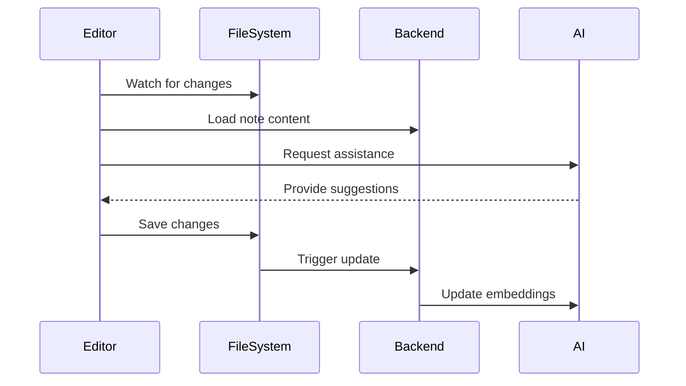

# Note Editor Technical Specification

## Overview
This specification outlines the addition of note creation and editing capabilities to the AI-powered note system, aiming to provide an experience similar to Obsidian's editor while maintaining our existing AI features.

## Core Requirements

### 1. Editor Interface

#### 1.1 Editor Components
- Split-pane view with configurable layout:
  - Edit mode (left): Raw markdown editing
  - Preview mode (right): Rendered markdown
- Toggle between split view and single pane (edit or preview)
- YAML frontmatter support for metadata
- Line numbers in edit mode
- Syntax highlighting for markdown
- Word/character count

#### 1.2 Text Editing Features
- Real-time markdown syntax highlighting
- Auto-completion for:
  - Markdown syntax
  - Internal links `[[]]`
  - Tags
  - Code blocks
- Support for common keyboard shortcuts:
  - Ctrl+B: Bold
  - Ctrl+I: Italic
  - Ctrl+K: Link
  - Ctrl+L: Toggle checklist
  - Cmd/Ctrl+/: Toggle comment
- Tab/Shift+Tab for indentation

### 2. File Management

#### 2.1 File Operations
- New note creation (Ctrl+N)
- Save (Ctrl+S)
- Auto-save with configurable interval
- Rename files
- Move files between folders
- Delete files (with confirmation)

#### 2.2 File Browser
- Hierarchical folder structure
- Drag and drop file organization
- Quick file switcher (Ctrl+P)
- Recent files list
- File search by name

### 3. Technical Implementation

#### 3.1 Editor Core
- Use CodeMirror 6 as the base editor:
  - Native markdown support
  - Extensible architecture
  - Good performance with large files
  - Mobile-friendly

```typescript
interface EditorConfig {
  mode: 'split' | 'edit' | 'preview';
  autoSave: boolean;
  autoSaveInterval: number;  // milliseconds
  lineNumbers: boolean;
  spellCheck: boolean;
  fontSize: number;
  fontFamily: string;
  theme: 'light' | 'dark' | 'system';
}
```

#### 3.2 Markdown Processing
- Use `marked` for markdown rendering
- Custom extensions for:
  - Mathematical expressions (KaTeX)
  - Mermaid diagrams
  - Internal links
  - Task lists
  - Code syntax highlighting
- Custom markdown components:
  ```typescript
  interface MarkdownExtension {
    name: string;
    pattern: RegExp;
    render: (content: string) => HTMLElement;
  }
  ```

#### 3.3 File System Integration
- File watcher for real-time updates
- Atomic file operations
- Conflict resolution for simultaneous edits
- Change history tracking

```typescript
interface FileOperation {
  type: 'create' | 'update' | 'delete' | 'move';
  path: string;
  newPath?: string;  // for move operations
  content?: string;
  metadata?: {
    title?: string;
    tags?: string[];
    created: Date;
    modified: Date;
  };
}
```

### 4. AI Integration

#### 4.1 Real-time Assistance
- Inline AI suggestions (can be toggled)
- Context-aware completions
- Tag suggestions based on content

#### 4.2 Enhanced Features
- Real-time semantic analysis of current paragraph
- Related notes suggestions
- Automatic tag suggestions
- Smart internal linking suggestions

```typescript
interface AIAssistance {
  type: 'completion' | 'suggestion' | 'link' | 'tag';
  trigger: 'manual' | 'automatic';
  context: {
    beforeCursor: string;
    afterCursor: string;
    currentLine: string;
    selectedText?: string;
  };
  result: {
    content: string;
    confidence: number;
    metadata?: any;
  };
}
```

### 5. Backend API Extensions

Add new endpoints to support editor features:

```typescript
// File operations
POST   /api/notes/create
PUT    /api/notes/:id
DELETE /api/notes/:id
PATCH  /api/notes/:id/move
POST   /api/notes/:id/rename

// Editor assistance
POST   /api/assist/complete
POST   /api/assist/suggest-links
POST   /api/assist/analyze
POST   /api/assist/tags
```

### 6. User Interface Components

#### 6.1 Editor Toolbar
- Basic formatting buttons
- Insert menu (link, image, table)
- View mode toggle
- AI assistance toggle
- Save status indicator

#### 6.2 Context Menu
- Cut/Copy/Paste
- Format options
- Convert to/from various markdown elements
- AI assistance options
- Link creation

#### 6.3 Command Palette
- Search through all commands
- Quick formatting
- File operations
- AI features
- Keyboard shortcut hints

### 7. Data Flow



## Implementation Phases

### Phase 1: Basic Editor
1. Implement CodeMirror integration
2. Basic markdown support
3. File saving/loading
4. Split view implementation

### Phase 2: Enhanced Editing
1. Auto-completion
2. Keyboard shortcuts
3. File management
4. Command palette

### Phase 3: AI Integration
1. Real-time assistance
2. Smart completions
3. Link suggestions
4. Tag recommendations

### Phase 4: Advanced Features
1. Custom markdown extensions
2. Advanced file operations
3. Search improvements
4. Performance optimizations

## Testing Strategy

### Unit Tests
- Editor core functionality
- Markdown processing
- File operations
- AI integration points

### Integration Tests
- Editor and file system
- Editor and AI services
- Backend API integration

### End-to-End Tests
- Complete editing workflow
- File management operations
- AI assistance features

## Performance Requirements

- Initial load time: < 2 seconds
- Editor response time: < 50ms
- Save operation: < 100ms
- AI suggestions: < 500ms
- Memory usage: < 200MB
- Support for files up to 1MB
- Smooth scrolling with files > 10,000 lines

## Security Considerations

1. File system access restrictions
2. Input sanitization
3. AI prompt injection prevention
4. YAML frontmatter validation
5. File operation validation

## Accessibility

1. Keyboard navigation
2. Screen reader support
3. High contrast theme
4. Customizable font sizes
5. ARIA labels and roles

## Future Considerations

1. Mobile optimization
2. Collaborative editing
3. Version control integration
4. Plugin system
5. Custom themes
6. Extended AI capabilities